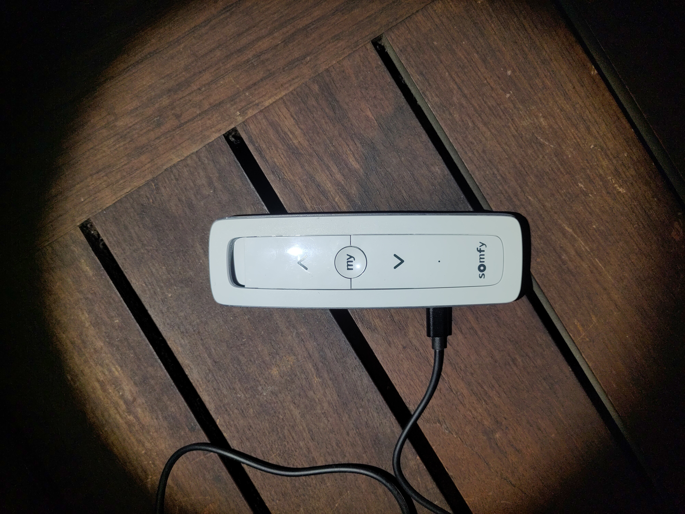
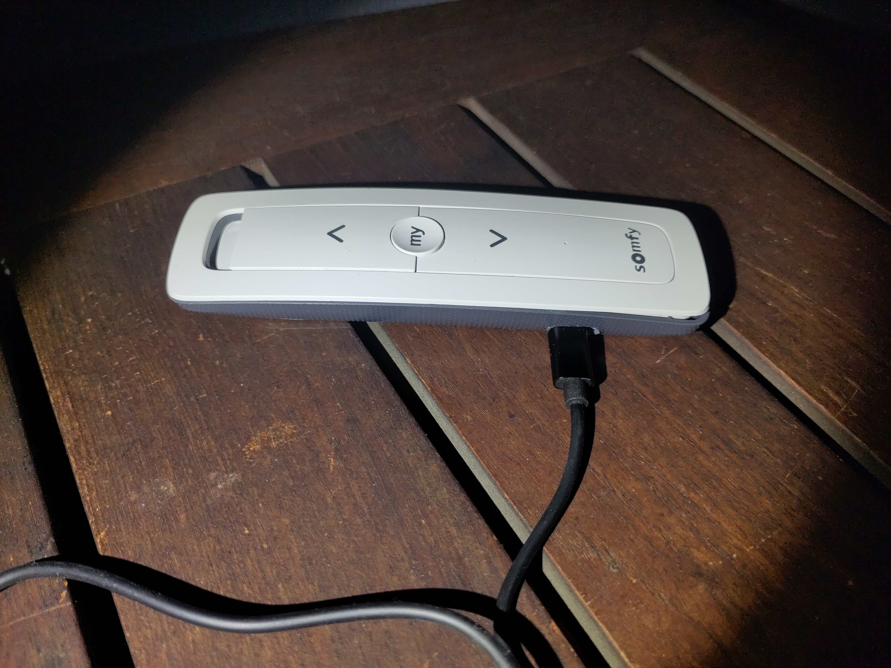
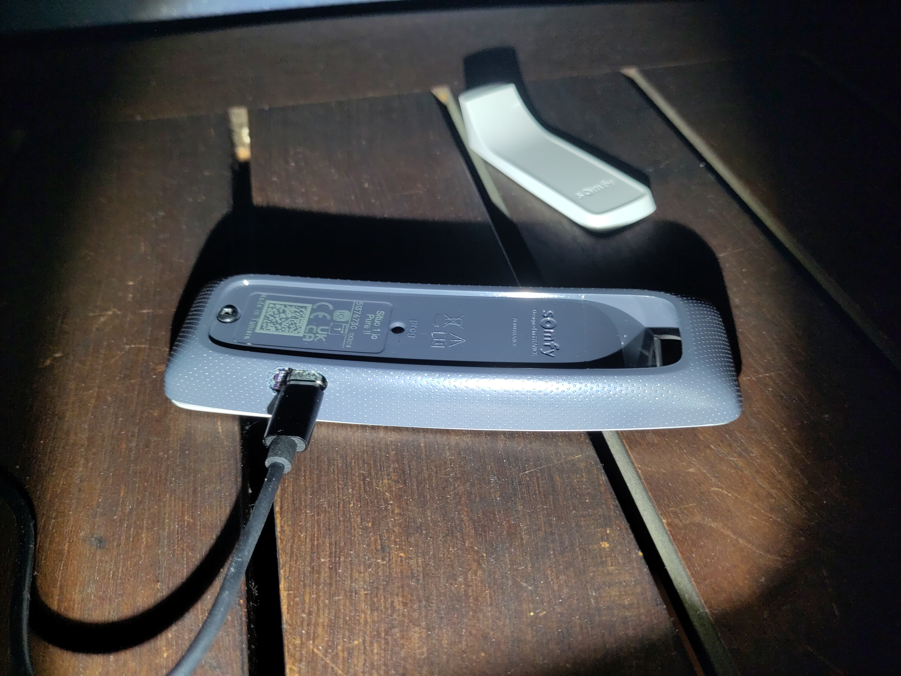
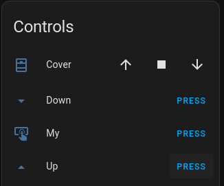
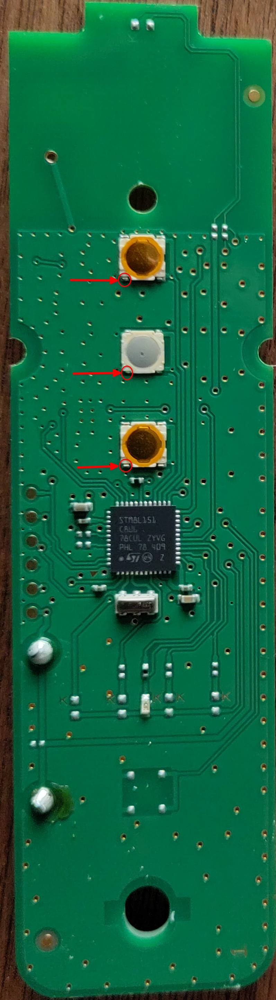
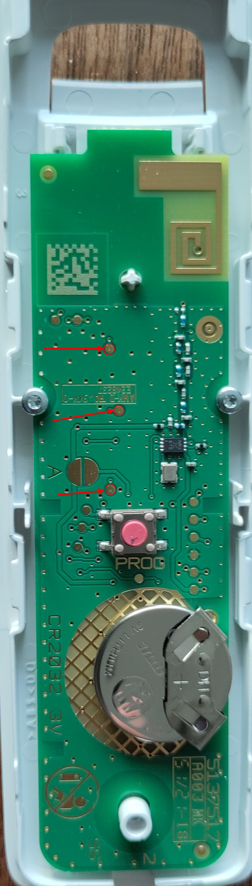
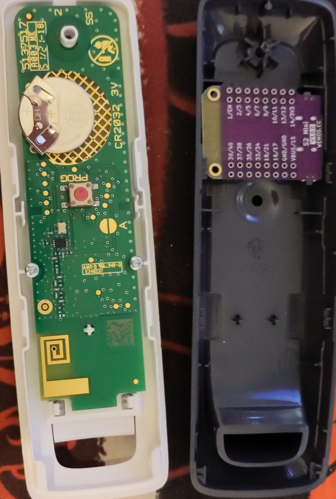

# Somfy-Situo-IO-ESP32
Journal of hacking a Wemos S2 mini onto a Somfy Situo IO 1 Pure II for use with HomeAssistant.
I just want to control the 3 (or maybe all 4) buttons from Home Assistant to automate my screens.

Credits to https://github.com/agvdberg/SomfyIO_ESPHome_HomeAssistant for their work on the previous gen remote.

## Button layout
- pin 1: up
- pin 2: my/stop
- pin 3: down

## End product

Doesn't exactly fit into the original case. 
Used a dremel to cut a hole for the USB-C cable and to remove some material on the inside for the microcontroller to fit.

Home Assistant provides the desired controls and uses the given time to indicate the progression.

## Code
[esp.yaml](esp.yaml) contains the code for the ESP device.
Using the time based cover for friendly controls in HomeAssistant.

## Findings
Checking continuity between front and backside from left bottom pin on button to other side triggered the button.
Think the bottom side will work to solder wires to.

### Idea for layout
Want to keep the remote as original as possible. The idea is to put the S2 mini inside the remote if it fits with a little bit of cutting.
The remote can run from the 3.3V on the ESP.

The buttons still have to properly function when they're manually pressed.

## TODO
1. [x] Remove the battery
1. [x] Solder wiring to the contacts
1. ~~Connect the wiring to a perf board to test functionality~~
1. [x] Solder the wiring to the S2 mini
1. [x] Cut a hole for the USB-C connector to fit a cable to
1. [x] Get it all back together
1. [x] Enjoy home automation
